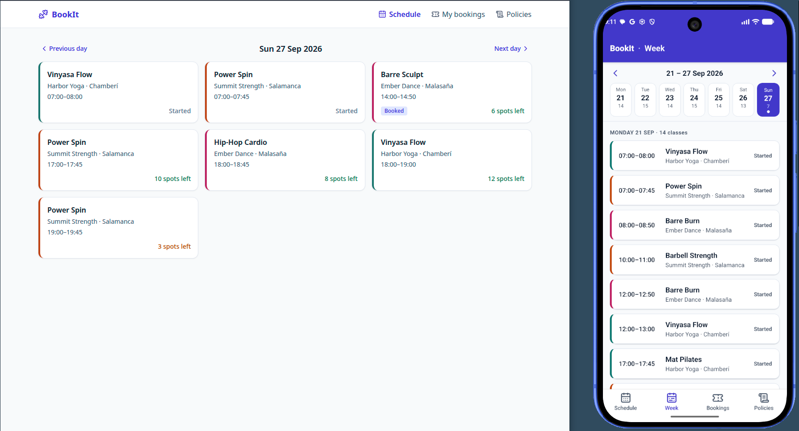

# BookIt - System Under Test

**A class-booking app built to be tested, not used.** It is the System
Under Test (SUT) for a separate multi-platform test automation framework,
and runs on four platforms: desktop web, mobile web, Android and iOS.


[](https://github.com/alapisco/book-it/releases/latest)
[](LICENSE)
<br>


> [!IMPORTANT]
> **A test fixture, not a product.** The platforms differ on purpose, and
> every difference is documented in the [parity matrix](#platform-parity-matrix).
> A feature missing on one platform is the point, not a bug.

<p align="center">
  
  <br>
  <em>The same day on desktop web (a day view with no week view, by design)
  and on Android (week view with a day strip and bottom tabs).</em>
</p>

## Quick start for testers

You need Docker, and an Android emulator or iOS simulator (macOS) for the
native apps.

1. **Start the backend and web app** at the tag that matches the apps you
   download:
   ```sh
   git clone https://github.com/alapisco/book-it.git && cd book-it
   git checkout v1.1          # the release's tag
   docker compose up --build  # API on :8000, web/wap on :5173
   ```
2. **Install the apps** from [Releases](https://github.com/alapisco/book-it/releases/latest):
   ```sh
   adb install -r bookit-v1.1.apk                   # running Android emulator
   unzip bookit-v1.1-ios-simulator.zip              # contains BookIt.app
   xcrun simctl install booted BookIt.app           # booted iOS simulator
   ```
   They need no configuration: they reach the API on your machine
   (`10.0.2.2` from the emulator, `localhost` from the simulator). The
   iOS build runs on simulators only, not physical iPhones; the APK is
   debug-signed, for emulators.
3. **Log in** as `ava@bookit.test`, password `bookit123`. More seed users
   and the test hooks are [below](#test-support).

For desktop web and wap, open http://localhost:5173. It renders `web` at
768 px wide or more, and `wap` below 768 px.

For Appium capabilities, see
[app/README.md](app/README.md#3-build-installable-files-for-automation).

## Why it exists

The main thing the framework shows is a **platform parity model**. It
declares which platforms support which features, runs one test body on
every supporting platform, auto-skips the others with a stated reason,
and publishes a parity matrix. To show that, the SUT needs deliberate,
documented divergence between platforms.

**Domain:** Studios → Classes (capacity, start time, instructor) → Bookings → Users.

**Core flow, present on every platform:** log in → browse schedule →
select a class → confirm → see it in "My bookings" → cancel.

**Platforms:** `web` (desktop browser), `wap` (mobile browser, with a
genuinely different component tree), `android` and `ios` (native).

## Platform parity matrix

| Feature | web | wap | android | ios |
|---|:-:|:-:|:-:|:-:|
| Login | ✅ | ✅ | ✅ | ✅ |
| Browse + book | ✅ | ✅ | ✅ | ✅ |
| My bookings + cancel | ✅ | ✅ | ✅ | ✅ |
| Week view (day strip + list) | ❌ | ✅ | ✅ | ✅ |
| Export booking to .ics | ✅ | ❌ | ❌ | ❌ |
| Waitlist when class full | ✅ | ✅ | ✅ | ❌ |
| QR check-in | ❌ | ❌ | ✅ | ✅ |
| Studio policies page | ✅ | ✅ | 🌐 webview | 🌐 webview |

Divergence runs deliberately in both directions: `.ics` export is
web-only, the week view is on every platform *except* desktop web, QR
check-in is native-only, and waitlist is missing only on iOS. The last
row is a webview that renders the same HTML page as `wap`, embedded in
both native apps.

Status: **every feature in the matrix is implemented**, and M4 is tested
on web, wap, android and ios. Desktop web has a top nav bar; wap, android
and ios have bottom tabs: Schedule · Week · Bookings · Policies
(ADR 0008). See [`docs/ROADMAP.md`](docs/ROADMAP.md) and
[`CHANGELOG.md`](CHANGELOG.md).

## Test support

**Seed users** (password `bookit123`):
- `ava@bookit.test`: has bookings
- `ben@bookit.test`: has none
- `cara@bookit.test`: at the booking limit

**Hooks** (`docs/prd/test-support.md`):
- `POST /test/reset`
- the `X-Test-Session` header
- the clock: the `X-Test-Now` header, or `POST /test/clock` and
  `POST /test/clock/advance`
- chaos: `PUT /test/chaos`
- `POST /test/classes/{id}/fill`
- anchor classes: `anchor-full`, `anchor-last-seat`,
  `anchor-cancel-closed`, `anchor-cancel-open`
- the platform matrix: `GET /flags`
- the `X-Platform` header: server-side feature gating, e.g. waitlist
  returns `403` for `ios`
- the seed waitlist: two guests on `anchor-full`
- the QR scanner: `POST /checkins` with `X-Studio-Key: scan-<studio>`.
  For manual demos, run `python3 scripts/simulate_scan.py <code> --studio harbor`.

A UI joins a test session with `?testSession=<id>` on web, or
`bookit://login?testSession=<id>` on native.

The API's interactive docs are at http://localhost:8000/docs, and the
contract is `docs/api/openapi.json`.

---

## For contributors

### Layout

| Path | What |
|---|---|
| `api/` | FastAPI + pydantic backend, in-memory store, test-support endpoints |
| `web/` | Vite + React + TS + Tailwind SPA serving `web` and `wap` |
| `app/` | Expo + React Native app (`expo prebuild`) serving `android` and `ios` ([app/README.md](app/README.md)) |
| `fixtures/` | Seed data shared by backend, web and mobile ([fixtures/README.md](fixtures/README.md)) |
| `docs/prd/` | Feature specs (versioned) |
| `docs/design/` | Written UI specs; `testids.md` is the identifier registry |
| `docs/tech/` | Tech specs: contract, rule order, per-platform implementation |
| `docs/adr/` | Architecture decision records |
| `docs/api/openapi.json` | Generated from the FastAPI app. Never hand-edited |
| `docs/ROADMAP.md` | Milestones and document status |
| `scripts/check_testids.py` | Identifier validator |
| `CLAUDE.md`, `.claude/` | Conventions, roles, commands and hooks for Claude Code |

### Running from source

**API + web/wap:** `docker compose up --build`. Without Docker, run the
two pieces separately:
- API: `cd api && pip install -r requirements.txt && uvicorn bookit.main:app --port 8000`
- Web: `cd web && npm ci && npm run dev`

**android / ios:** built locally against the emulator and simulator.
[app/README.md](app/README.md) covers:
- one-time machine setup: JDK 17, `ANDROID_HOME`, Xcode
- running for development
- building the release `.apk` / `.app` that Appium uses
  (`npm run build:android`, `npm run build:ios`)
- [cutting a release](app/README.md#7-cutting-a-release) with both apps
  attached

### One-time setup per clone

```sh
git config core.hooksPath .githooks        # turn on the identifier pre-commit hook
python3 scripts/check_testids.py --all     # validate every identifier in web/ and app/
```

Open the repo in Claude Code once and accept the folder-trust prompt.
Claude Code skips the per-role hooks defined in `.claude/agents/*.md`
frontmatter for folders that haven't been trusted.

### How work gets done here

See **[docs/WORKFLOW.md](docs/WORKFLOW.md)** for the per-feature loop
(specify → design → implement → verify), the commands and roles, and what
to do when something breaks.

## License

[0BSD](LICENSE): use, copy, modify and distribute freely, with no
attribution required.
